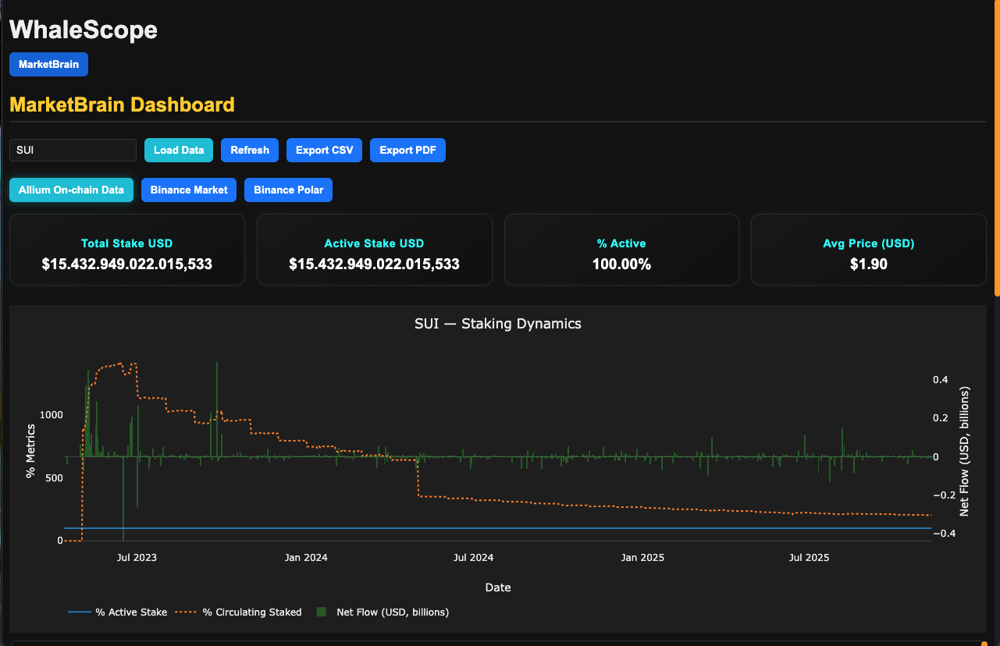
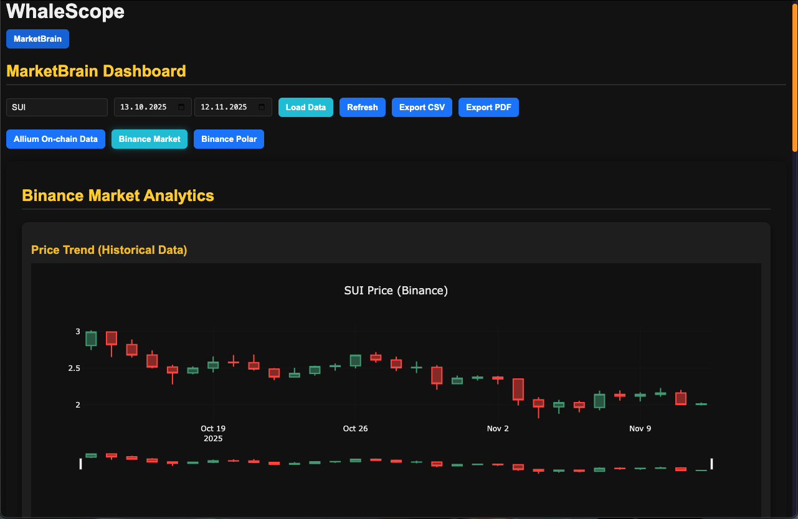
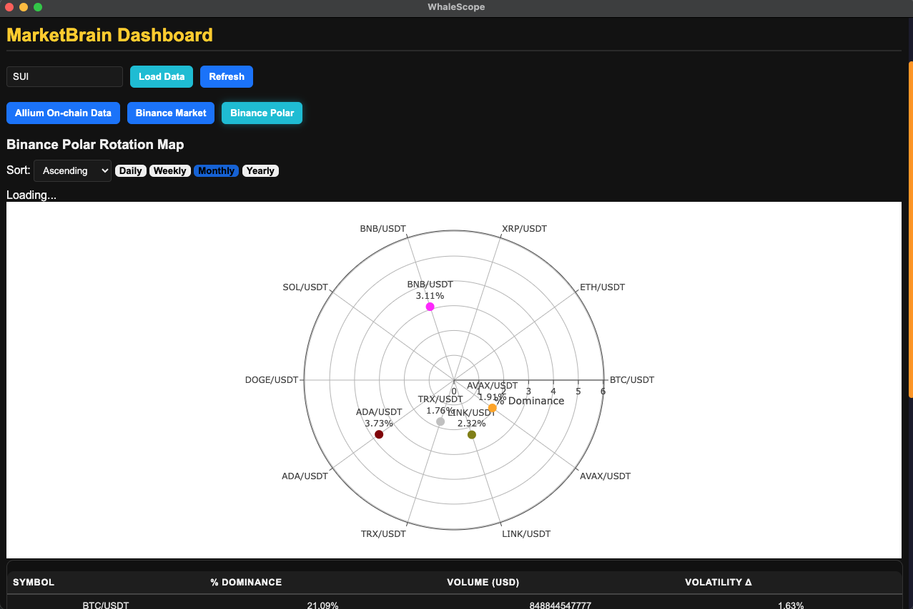
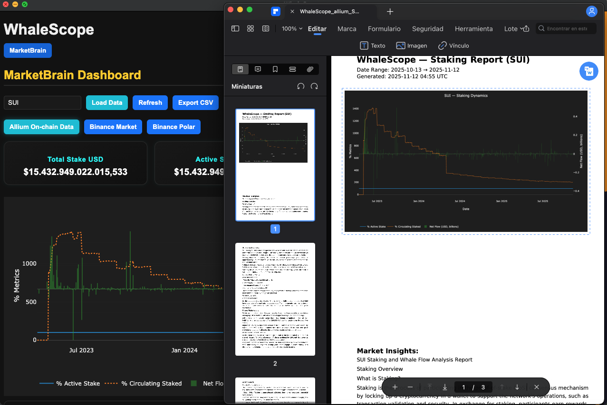

# 🐋 WhaleScope — Markkina- ja lohkoketjuanalytiikan työkalu

[🌍 Read this in English](README.md)

**WhaleScope** on monialustainen työpöytäsovellus, joka yhdistää lohkoketju- ja markkinadataa.  
Sovellus kehitettiin osana harjoittelua **Aalto-yliopiston talous- ja kauppatieteiden laitoksella**  
(Opiskelija: Tieto- ja viestintätekniikka (TVT), RASEKO, Turku)

---

## 🚀 Ominaisuudet
- Reaaliaikainen Binance-markkinadatan analytiikka  
- Visualisointipaneelit (Electron + Chart.js / Plotly)  
- Python-backend Flaskilla ja Pandas-kirjastolla  
- Raporttien vienti PDF- ja CSV-muotoon  
- Upotettu Python-tulkin tuki (ei erillistä asennusta)

---

## 🧠 Arkkitehtuuri
```
Electron (käyttöliittymä)
   │
   ├── IPC / spawn()
   │
   └── Python Flask-backend
         ├── whalescope_scripts/
         ├── SQLite3-tietokanta
         └── REST API (localhost:5001)
```

---

## 🖼️ Kuvakaappaukset

| Hallintapaneeli | MarketBrain | Binance Polar |
|-----------------|--------------|---------------|
|  |  |  |

### 📄 PDF-viennin esimerkki


---

## ⚙️ Käyttöohjeet ja asennus

### 1️⃣ Vaatimukset
- macOS (testattu macOS Ventura / Sonoma)
- Node.js versio 18 tai uudempi
- Python 3.11 (vain kehitystilassa tarvitaan)

---

### 2️⃣ Kloonaa projektin repo
```bash
git clone https://github.com/CAUCORASEKO/whalescope.git
cd whalescope/electron
```

---

### 3️⃣ Asenna riippuvuudet
```bash
npm install
```

---

### 4️⃣ Käynnistä kehitystilassa
Tämä komento käynnistää Electron-sovelluksen ja Python-backendin paikallisesta virtuaaliympäristöstä (`.venv`):

```bash
npm start
```

Pitäisi näkyä seuraava viesti:

```
[Main] 🐍 Starting Backend:
 → Python: .venv/bin/python3
 → Script: python/whalescope_scripts/backend_ultra_pro.py
 * Running on http://127.0.0.1:5001
```

Electron-sovelluksen ikkuna avautuu automaattisesti.

---

### 5️⃣ Luo asennuspaketti (.dmg)
Voit rakentaa itsenäisen macOS-sovelluksen, joka sisältää upotetun Python-ympäristön:

```bash
npm run dist:intel
```

Rakennettu tiedosto löytyy hakemistosta:

```
electron/dist/WhaleScope-1.0.0.dmg
```

Tämän `.dmg`-tiedoston voi jakaa suoraan — se toimii millä tahansa Macilla **ilman Pythonin asennusta**.

---

### 🧪 Vianmääritys

| Ongelma | Ratkaisu |
|----------|-----------|
| `Address already in use: 5001` | Sulje edellinen backend-prosessi: `lsof -i :5001` → `kill -9 PID` |
| `"Empty output from script"` | Varmista, että `python/`-kansio kopioitui oikein `Resources/`-hakemistoon |
| macOS estää sovelluksen avaamisen | Klikkaa hiiren oikealla → “Avaa” → vahvista ensimmäinen käynnistys |

---

## 🧑‍💻 Kehittäjä

**Claudio Valenzuela (CAUCO)**  
- RASEKO – Tieto- ja viestintätekniikka (TVT), Turku  
- Harjoittelu Aalto-yliopistossa, Talous- ja kauppatieteiden laitos  
- Toiminimi (Tmi) Ohjelmistokehittäjä ja Data-analyytikko  

🔗 **Linkit:**  
[LinkedIn-profiili](https://www.linkedin.com/in/multimedia3d/)  
[GitHub-profiili](https://github.com/CAUCORASEKO)

---

## 📄 Lisenssi
MIT-lisenssi © 2025 Claudio Valenzuela (CAUCO)
